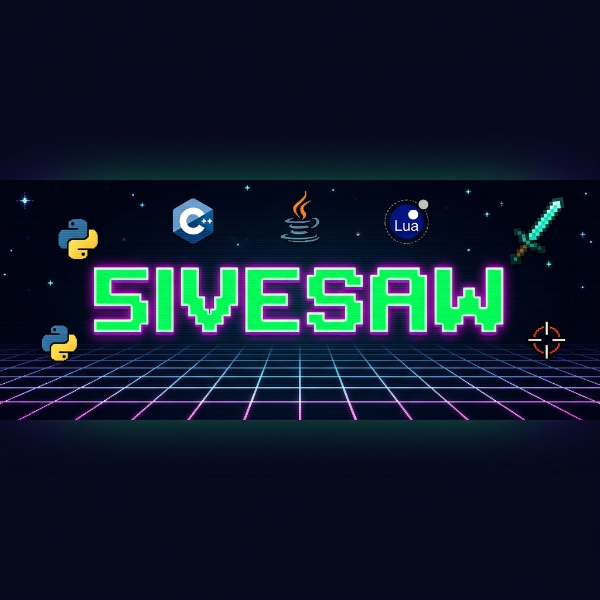
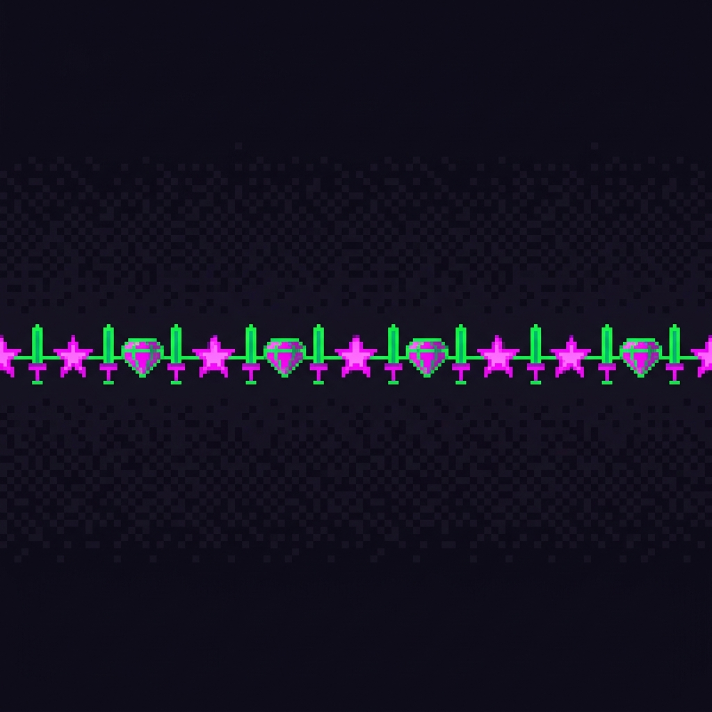
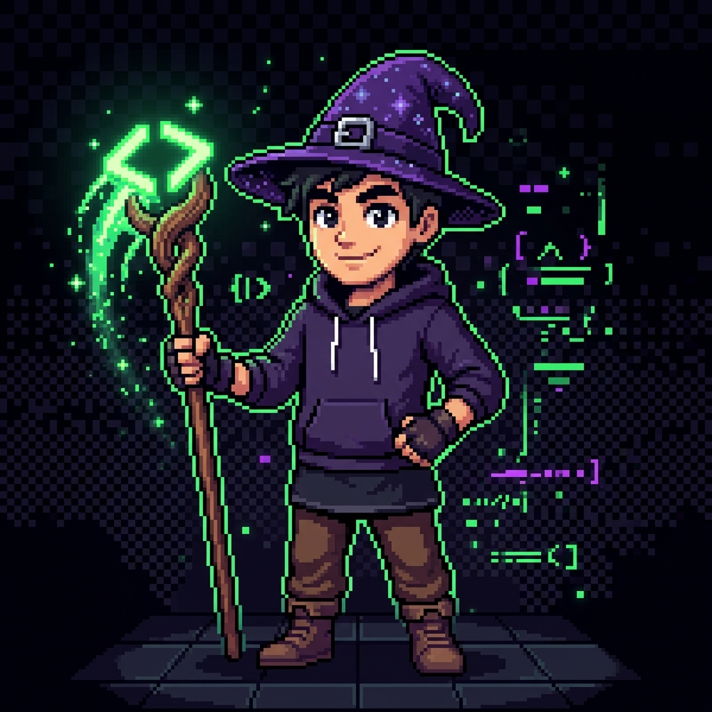

<!-- ╔══════════════════════════════════════════════════════════════════════════════╗ -->
<!-- ║                                                                              ║ -->
<!-- ║   ███████╗██╗██╗   ██╗███████╗███████╗ █████╗ ██╗    ██╗                     ║ -->
<!-- ║   ██╔════╝██║██║   ██║██╔════╝██╔════╝██╔══██╗██║    ██║                     ║ -->
<!-- ║   ███████╗██║██║   ██║█████╗  ███████╗███████║██║ █╗ ██║                     ║ -->
<!-- ║   ╚════██║██║╚██╗ ██╔╝██╔══╝  ╚════██║██╔══██║██║███╗██║                     ║ -->
<!-- ║   ███████║██║ ╚████╔╝ ███████╗███████║██║  ██║╚███╔███╔╝                     ║ -->
<!-- ║   ╚══════╝╚═╝  ╚═══╝  ╚══════╝╚══════╝╚═╝  ╚═╝ ╚══╝╚══╝                     ║ -->
<!-- ║                                                                              ║ -->
<!-- ║              ⚔️  WELCOME TO THE REALM OF 5IVESAW  ⚔️                         ║ -->
<!-- ╚══════════════════════════════════════════════════════════════════════════════╝ -->

<div align="center">

<!-- ==================== BANNER ==================== -->


<br/>

<!-- ==================== TYPING SVG ==================== -->
<a href="https://git.io/typing-svg">
  
</a>

<br/>

<!-- ==================== BADGES ROW ==================== -->


&nbsp;&nbsp;

&nbsp;&nbsp;

&nbsp;&nbsp;


</div>

<!-- ==================== PIXEL DIVIDER ==================== -->


<!-- ══════════════════════════════════════════════════════════ -->
<!--                   ⚔️ CHARACTER SELECT ⚔️                  -->
<!-- ══════════════════════════════════════════════════════════ -->

<h2 align="center">⚔️ CHARACTER SELECT ⚔️</h2>

<table>
<tr>
<td width="35%" align="center" valign="top">

<br/>



<br/><br/>

```
╔══════════════════════════╗
║    ★ 5 I V E S A W ★    ║
╠══════════════════════════╣
║  CLASS: Code Wizard 🧙   ║
║  TITLE: Pixel Artisan    ║
║  REALM: Arcadia 🏰       ║
╠══════════════════════════╣
║  STR ████████░░  80/100  ║
║  INT ██████████ 100/100  ║
║  DEX ███████░░░  70/100  ║
║  WIS ████████░░  80/100  ║
║  LCK █████░░░░░  50/100  ║
║  CHA █████████░  90/100  ║
╠══════════════════════════╣
║  HP  ██████████ 999/999  ║
║  MP  ████████░░ 800/999  ║
╚══════════════════════════╝
```

</td>
<td width="65%" valign="top">

<br/>

### 📜 LORE & BACKSTORY

> *In the pixelated lands of **The Kingdom of Arcadia**, where code compiles at the speed of light and creepers lurk in every shadow, there exists a legendary coder known only as **5ivesaw** — a Code Wizard who wields the ancient languages of Python, C++, Java, and the mystical Lua scripts...*

<br/>

### 🗺️ WORLD INFO

| 🏰 Attribute | 📋 Details |
|:---:|:---|
| **Kingdom** | The Sovereign Kingdom of Arcadia |
| **Capital** | Byteburg (Pop. 65,536) |
| **Province** | The Silicon Highlands |
| **Currency** | Pixelcoin (PXL) ₿ |
| **Language** | Binary, English, Sarcasm |
| **Climate** | Perpetually 8-bit sunny ☀️ with occasional glitch storms ⛈️ |
| **Government** | Technocratic Pixel Monarchy |
| **National Motto** | *"Segfault and Conquer"* |
| **Timezone** | UTC+∞ (time is an illusion) |

<br/>

### 🎯 CURRENT QUEST

```
 ╔═══════════════════════════════════════╗
 ║ ☐ Master the ancient art of C++      ║
 ║ ☑ Build legendary Python scripts     ║
 ║ ☐ Reach Immortal in Valorant         ║
 ║ ☑ Create insane Minecraft redstone   ║
 ║ ☐ Contribute to open source realms   ║
 ║ ☐ Defeat the final boss (burnout)    ║
 ╚═══════════════════════════════════════╝
```

</td>
</tr>
</table>

<!-- ==================== PIXEL DIVIDER ==================== -->


<!-- ══════════════════════════════════════════════════════════ -->
<!--                  🛡️ INVENTORY (TECH STACK) 🛡️             -->
<!-- ══════════════════════════════════════════════════════════ -->

<h2 align="center">🛡️ INVENTORY — WEAPONS & TOOLS 🛡️</h2>

<div align="center">

```
┌──────────────────────────────────────────────────────────────┐
│  ⚔️  EQUIPPED WEAPONS (PRIMARY LANGUAGES)                    │
└──────────────────────────────────────────────────────────────┘
```

<br/>

<a href="https://skillicons.dev">
  
</a>

<br/><br/>

| 🗡️ Weapon | ⭐ Mastery | 📖 Description |
|:---:|:---:|:---|
|  **Python** | ★★★★★ | *The Serpent Staff — my primary weapon of mass creation. From automation spells to AI incantations.* |
|  **C++** | ★★★★☆ | *The Obsidian Blade — raw power, unmatched speed. Segfaults are just battle scars.* |
|  **Java** | ★★★★☆ | *The Enchanted Hammer — verbose but reliable. Object-oriented sorcery at its finest.* |
|  **Lua** | ★★★☆☆ | *The Moonstone Dagger — lightweight, embedded magic. Perfect for scripting game worlds.* |

<br/>

```
┌──────────────────────────────────────────────────────────────┐
│  🛡️  ARMOR & ACCESSORIES (TOOLS & TECHNOLOGIES)             │
└──────────────────────────────────────────────────────────────┘
```

<br/>

<a href="https://skillicons.dev">
  
</a>

<br/><br/>

</div>

<!-- ==================== PIXEL DIVIDER ==================== -->


<!-- ══════════════════════════════════════════════════════════ -->
<!--                    🎮 GAMING GUILD 🎮                     -->
<!-- ══════════════════════════════════════════════════════════ -->

<h2 align="center">🎮 GAMING GUILD — ACTIVE CAMPAIGNS 🎮</h2>

<div align="center">

```
 ╔═══════════════════════════════════════════════════════════╗
 ║                                                           ║
 ║     "ALL WORK AND NO PLAY MAKES 5IVESAW A DULL CODER"    ║
 ║                                                           ║
 ╚═══════════════════════════════════════════════════════════╝
```

</div>

<br/>

<table>
<tr>
<td width="50%" valign="top" align="center">

### 🔫 VALORANT

<br/>


<br/><br/>

```
╔════════════════════════════╗
║   🎯 AGENT DOSSIER        ║
╠════════════════════════════╣
║  MAIN: Variable 🔄        ║
║  ROLE: Flex Player         ║
║  RANK: Classified 🤫       ║
║  HOURS: Too Many ∞        ║
╠════════════════════════════╣
║  ACCURACY:  ████████░░ 82%║
║  GAME SENSE:█████████░ 92%║
║  TOXICITY:  ░░░░░░░░░░  0%║
║  CLUTCH:    ████████░░ 85%║
╚════════════════════════════╝
```

> *"Defusing the spike is just like debugging — stay calm, read the code, and pray."* 🙏

</td>
<td width="50%" valign="top" align="center">

### ⛏️ MINECRAFT

<br/>


<br/><br/>

```
╔════════════════════════════╗
║   ⚙️ TECHNICAL PROFILE    ║
╠════════════════════════════╣
║  TYPE: Highly Technical ⚡ ║
║  FOCUS: Redstone & Farms   ║
║  BUILDS: Mega Structures   ║
║  HOURS: Yes. ∞            ║
╠════════════════════════════╣
║  REDSTONE:  ██████████100%║
║  BUILDING:  ████████░░ 80%║
║  PVP:       ███████░░░ 70%║
║  SURVIVAL:  █████████░ 90%║
╚════════════════════════════╝
```

> *"I didn't just build a calculator in Minecraft. I built a whole ALU with pipelining."* 🤯

</td>
</tr>
</table>

<div align="center">

<br/>

<details>
<summary>🕹️ <b>CLICK TO VIEW FULL GAME LIBRARY</b> 🕹️</summary>

<br/>

| 🎮 Game | ⏱️ Status | 💬 Notes |
|:---:|:---:|:---|
| Valorant | 🟢 Active | *Headshots go brrrr* |
| Minecraft | 🟢 Active | *Redstone wizard, technical player* |
| CS2 | 🟡 Sometimes | *Old habits die hard* |
| Terraria | 🟡 Sometimes | *2D Minecraft but actually different, fight me* |
| Stardew Valley | 🔵 Vibing | *Farming simulator for the soul* |
| Dark Souls | 🔴 Pain | *You Died. You Died. You Died.* |

</details>

</div>

<!-- ==================== PIXEL DIVIDER ==================== -->


<!-- ══════════════════════════════════════════════════════════ -->
<!--                📊 BATTLE STATISTICS 📊                    -->
<!-- ══════════════════════════════════════════════════════════ -->

<h2 align="center">📊 BATTLE STATISTICS — GITHUB ANALYTICS 📊</h2>

<div align="center">

```
 ┌──────────────────────────────────────────┐
 │  📡 LIVE FEED FROM THE ARCADIAN SERVERS  │
 └──────────────────────────────────────────┘
```

<br/>

<!-- GitHub Stats Card -->
<a href="https://github.com/5ivesaw">
  
</a>
&nbsp;
<a href="https://github.com/5ivesaw">
  
</a>

<br/><br/>

<!-- Streak Stats -->
<a href="https://github.com/5ivesaw">
  
</a>

<br/><br/>

<!-- Activity Graph -->
<a href="https://github.com/5ivesaw">
  
</a>

<br/><br/>

<!-- Trophies -->

```
 ┌──────────────────────────────────────────┐
 │  🏆 ACHIEVEMENT UNLOCKED                │
 └──────────────────────────────────────────┘
```

<br/>

<a href="https://github.com/ryo-ma/github-profile-trophy">
  
</a>

</div>

<!-- ==================== PIXEL DIVIDER ==================== -->


<!-- ══════════════════════════════════════════════════════════ -->
<!--                🐍 CONTRIBUTION SNAKE 🐍                   -->
<!-- ══════════════════════════════════════════════════════════ -->

<h2 align="center">🐍 THE CONTRIBUTION SERPENT 🐍</h2>

<div align="center">

```
 ┌──────────────────────────────────────────────────────┐
 │  🐍 Watch the serpent devour my contribution graph!  │
 └──────────────────────────────────────────────────────┘
```

<br/>

<picture>
  <source media="(prefers-color-scheme: dark)" srcset="https://raw.githubusercontent.com/5ivesaw/5ivesaw/output/github-snake-dark.svg" />
  <source media="(prefers-color-scheme: light)" srcset="https://raw.githubusercontent.com/5ivesaw/5ivesaw/output/github-snake.svg" />
  
</picture>

</div>

<!-- ==================== PIXEL DIVIDER ==================== -->


<!-- ══════════════════════════════════════════════════════════ -->
<!--              🎵 NOW PLAYING / FUN ZONE 🎵                -->
<!-- ══════════════════════════════════════════════════════════ -->

<h2 align="center">🎵 TAVERN JUKEBOX & FUN ZONE 🎵</h2>

<div align="center">

<br/>

<table>
<tr>
<td width="50%" align="center" valign="top">

### 🎲 RANDOM DEV QUOTE

<br/>


</td>
<td width="50%" align="center" valign="top">

### 😂 RANDOM DEV MEME

<br/>


</td>
</tr>
</table>

<br/>

### 🧮 FUN FACTS ABOUT THIS ADVENTURER

```
╔══════════════════════════════════════════════════════════════════╗
║                                                                  ║
║  🎮  I've probably mass more hours gaming than coding.           ║
║      ...probably.                                                ║
║                                                                  ║
║  🐍  My first language was Python. We've been inseparable       ║
║      ever since (except when I segfault in C++).                ║
║                                                                  ║
║  ⛏️   I once built a working CPU in Minecraft.                   ║
║      It could add numbers. I cried tears of joy.                ║
║                                                                  ║
║  🏰  The Kingdom of Arcadia has a 99.99% uptime.                ║
║      The 0.01% was a "planned" maintenance window.              ║
║                                                                  ║
║  🌙  Lua means "moon" in Portuguese. I use Lua because          ║
║      I too am mysterious and only appear at night.              ║
║                                                                  ║
║  ☕  I drink mass amounts of caffeine. My blood type            ║
║      is literally Coffee++.                                     ║
║                                                                  ║
║  🤖  I don't write bugs. I write surprise features.             ║
║                                                                  ║
╚══════════════════════════════════════════════════════════════════╝
```

</div>

<!-- ==================== PIXEL DIVIDER ==================== -->


<!-- ══════════════════════════════════════════════════════════ -->
<!--               📡 CONNECT / SOCIAL LINKS 📡               -->
<!-- ══════════════════════════════════════════════════════════ -->

<h2 align="center">📡 COMMUNICATION CHANNELS 📡</h2>

<div align="center">

```
 ┌──────────────────────────────────────────┐
 │  📨 SEND A RAVEN TO THE KINGDOM         │
 └──────────────────────────────────────────┘
```

<br/>

<!-- Replace # with your actual links -->
<a href="https://github.com/5ivesaw"></a>
&nbsp;
<a href="#"></a>
&nbsp;
<a href="#"></a>
&nbsp;
<a href="#"></a>
&nbsp;
<a href="mailto:#"></a>

<br/><br/>

### 💎 SUPPORT THE KINGDOM

*If you like what you see, consider dropping a ⭐ on my repos!*

<a href="https://github.com/5ivesaw?tab=repositories">
  
</a>

</div>

<!-- ==================== PIXEL DIVIDER ==================== -->


<!-- ══════════════════════════════════════════════════════════ -->
<!--                    🏰 FOOTER 🏰                          -->
<!-- ══════════════════════════════════════════════════════════ -->

<div align="center">

<br/>

```
╔══════════════════════════════════════════════════════════════════════╗
║                                                                      ║
║                    ⚔️  THANKS FOR VISITING!  ⚔️                      ║
║                                                                      ║
║         "In the Kingdom of Arcadia, every commit is a quest,         ║
║          every push is an adventure, and every merge conflict         ║
║                    is a boss battle." — 5ivesaw                       ║
║                                                                      ║
║   ░░░░░░░░░░░░░░░░░░░░░░░░░░░░░░░░░░░░░░░░░░░░░░░░░░░░░░░░░░░░    ║
║   ░░██░░░░██░░██████░░██░░░░██░░██████░░░░██░░░░██░░██████░░░░░░    ║
║   ░░██░░░░██░░██░░░░░░██░░░░██░░██░░░░░░░░██░░░░██░░██░░░░░░░░░░    ║
║   ░░████████░░████░░░░██░░░░██░░████░░░░░░██░░░░██░░████░░░░░░░░    ║
║   ░░██░░░░██░░██░░░░░░██░░░░██░░██░░░░░░░░██░░░░██░░██░░░░░░░░░░    ║
║   ░░██░░░░██░░██████░░██████░░░░██████░░░░██████░░░░██████░░░░░░    ║
║   ░░░░░░░░░░░░░░░░░░░░░░░░░░░░░░░░░░░░░░░░░░░░░░░░░░░░░░░░░░░░    ║
║                                                                      ║
╚══════════════════════════════════════════════════════════════════════╝
```

<br/>


</div>

<!-- 
  ██████╗ ██╗   ██╗██╗██╗  ████████╗    ██╗    ██╗██╗████████╗██╗  ██╗    ❤️
  ██╔══██╗██║   ██║██║██║  ╚══██╔══╝    ██║    ██║██║╚══██╔══╝██║  ██║
  ██████╔╝██║   ██║██║██║     ██║       ██║ █╗ ██║██║   ██║   ███████║
  ██╔══██╗██║   ██║██║██║     ██║       ██║███╗██║██║   ██║   ██╔══██║
  ██████╔╝╚██████╔╝██║███████╗██║       ╚███╔███╔╝██║   ██║   ██║  ██║
  ╚═════╝  ╚═════╝ ╚═╝╚══════╝╚═╝        ╚══╝╚══╝ ╚═╝   ╚═╝   ╚═╝  ╚═╝
-->
