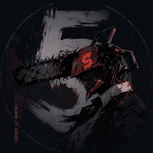

<div align="center">



<br/>

<a href="https://git.io/typing-svg">
  
</a>

<br/>


</div>


### About

```
fivesaw · he/him · ostania
```

Just a developer still figuring things out. I write code, break things, occasionally fix them.  
When I'm not coding I'm probably in a Valorant lobby or wiring redstone in Minecraft.

Discord — **fivesaw**


### Languages

> Still learning all of these. Not an expert in anything yet.

<p>
  
  
  
  
</p>

### Tools

<p>
  
  
  
</p>


### Stats

<div align="center">


<br/><br/>


</div>


### Games

<p>
  
  
</p>

Valorant — flex player, always rotating agents.  
Minecraft — technical player. Redstone, farms, and the occasional mega-build.


<details>
<summary><b>Dev Quote</b></summary>

<br/>

<div align="center">
  
</div>

</details>

<details>
<summary><b>Dev Meme</b></summary>

<br/>

<div align="center">
  
</div>

</details>

<details>
<summary><b>Contribution Graph</b></summary>

<br/>

<div align="center">
  <picture>
    <source media="(prefers-color-scheme: dark)" srcset="https://raw.githubusercontent.com/5ivesaw/5ivesaw/output/github-snake-dark.svg" />
    <source media="(prefers-color-scheme: light)" srcset="https://raw.githubusercontent.com/5ivesaw/5ivesaw/output/github-snake.svg" />
    
  </picture>
</div>

</details>


<div align="center">
  
</div>
