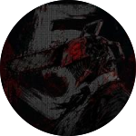

<div align="center">

<!-- ═══════════════════ HEADER ═══════════════════ -->


<a href="https://5ivesaw.github.io/5ivesaw/">
  
</a>

<br/>

<a href="https://git.io/typing-svg">
  
</a>

<br/><br/>

<a href="https://5ivesaw.github.io/5ivesaw/">
  
</a>


</div>


## ⌗ about


```text
> whoami
just a chainsaw figuring things out.
writing code, breaking it, occasionally fixing it. 
and brekaing it.
minecraft is just goated.
```

```text
◆ currently grinding python & c++ 
◇ building small games & scripts
◆ goal: stop breaking stuff someday
◇ dm me on discord: fivesaw
```

<br clear="right"/>


## ⌗ stack

still learning. not an expert. dangerous enough to be a problem.

<div align="center">

<table>
  <tr>
    <td align="center"><b>languages</b></td>
    <td align="center"><b>tools</b></td>
  </tr>
  <tr>
    <td align="center">
      
    </td>
    <td align="center">
      
    </td>
  </tr>
</table>

</div>


## ⌗ stats & activity

<div align="center">


<br/><br/>


<br/><br/>


<br/><br/>


</div>


## ⌗ games

<table>
  <tr>
    <td>
      
    </td>
    <td>
      flex player. rotating agents. clutch or throw, no in-between.
    </td>
  </tr>
  <tr>
    <td>
      
    </td>
    <td>
      tech player. redstone & farms. the villagers work for me.
    </td>
  </tr>
</table>


## ⌗ logs

<div align="center">


<br/><br/>


</div>


