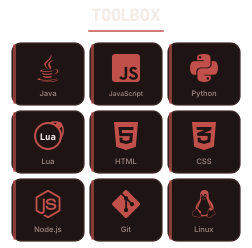

<table width="820" border="1" bordercolor="#3a2626" cellspacing="0" cellpadding="18">
<tr>
<td width="34%" align="center" valign="middle">

</td>
<td width="66%" align="center" valign="middle">

 

&nbsp;
&nbsp;

  

&nbsp;
&nbsp;

</td>
</tr>
</table>

