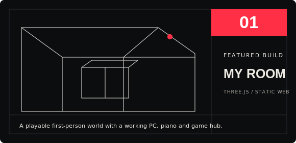
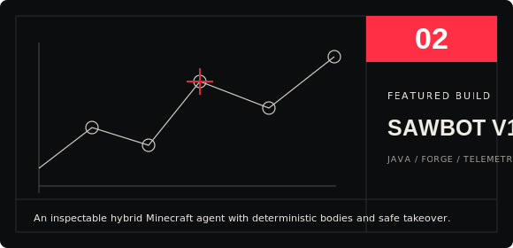
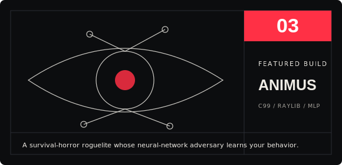
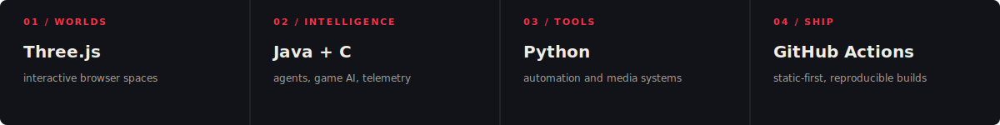

<picture>
  <source media="(prefers-color-scheme: dark)" srcset="./assets/banner-dark.svg">
  <source media="(prefers-color-scheme: light)" srcset="./assets/banner-light.svg">
  
</picture>

  <strong>I build interactive browser worlds, game systems, and inspectable autonomous agents.</strong> 
  Experiments first. Real controls, visible state, and working builds.

  <a href="https://5ivesaw.github.io/my-room/"><b>ENTER MY ROOM</b></a>
  &nbsp;&nbsp;·&nbsp;&nbsp;
  <a href="https://github.com/5ivesaw?tab=repositories"><b>ALL PROJECTS</b></a>
  &nbsp;&nbsp;·&nbsp;&nbsp;
  <a href="https://www.youtube.com/@5ivesaw"><b>YOUTUBE</b></a>

 

## Selected work

<table>
<tr>
<td width="50%" valign="top">

 
A playable first-person gothic room and castle with an interactive piano, physical gaming setup, fictional desktop OS, encrypted chat companion, and bundled game hub.

**[Live build](https://5ivesaw.github.io/my-room/)** · **[Source](https://github.com/5ivesaw/my-room)**
</td>
<td width="50%" valign="top">

 
A visible and inspectable Minecraft research agent built around structured observations, deterministic movement bodies, telemetry, safe takeover, and explicit control ownership.

**[Repository](https://github.com/5ivesaw/b0t)**
</td>
</tr>
</table>

A C99 survival-horror roguelite with a hand-built raycaster and a neural-network adversary that learns from player behavior. 
<strong><a href="https://github.com/5ivesaw/animus">Repository</a></strong>

 

## Working system

 

## Build principles

| Visible systems | Real interaction | Small-machine aware |
|:---|:---|:---|
| State, telemetry, and failure modes should be inspectable. | Input should behave like input—not hidden magic. | Projects should remain usable on ordinary hardware. |

 

  FiveSaw / 5ivesaw · games, tools, browser worlds, and experiments

